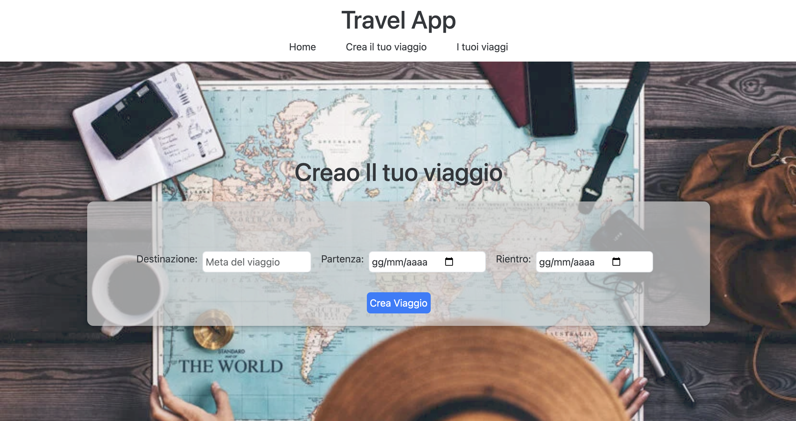

 Travel App

## Descrizione del Progetto
Travel App è un applicazione progettata per consentire all'utente di creare un viaggio e successivamente di poter aggiungere tappa per ogni giornata del viaggio. Quando viene aggiunta una tappa è possibile visualizzare la sua posizione sulla mappa tramite geolocalizzazione.

## Funzionalità principale
- __Crea il tuo viaggio__ : l'utente aggiungere un nuovo viaggio inserendo la destinazione del viaggio,la data di partenza e la data di ritorno.
Successivamente si viene reindirizzati alla pagina del dettaglio del viaggio dove vengono aggiunti automaticamente i campi relativi alle giornate del viaggio.

- __Aggiungi tappa__ : Cliccando sul bottone aggiungi tappa è possibile appunto aggiungere una tappa al viaggio aggiungendo un titolo,una descrizione,un indirizzo e se desiderato un immagine.
Una volta aggiunta la tappa comparirà all'interno di una card, sara possibile eliminare eliminare la tappa modificarne lo stato della tappa se completata o ancora no,oppure cliccando sulla tappa possiamo vedere il dettaglio della tappa.

- __Dettaglio tappa__: Cliccando sulla card della tappa possiamo visualizzare tutti i dati della tappa e anche la posizione di essa sulla mappa.

## Tecnologie utilizzate
- __Backend__: Php
- __Frontend__: Vue.js
- __Mappe__: TomTom API

## Installazione
